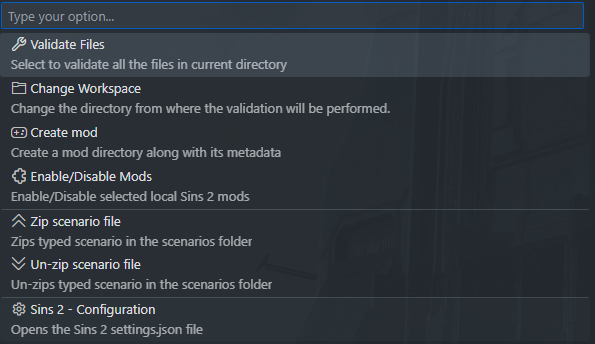

# Jabberwocky: Sins II Language Support
  

**Jabberwocky** adds validation to Sins 2 game files for modding inside of **Visual Studio Code**


## Note

This extension is in preview and may stop working unexpectedly

## Current Features

-   Diagnostics
-   Autocompletion
-   On-hover information

## Installation

- Install the extension through the [Marketplace]("https://marketplace.visualstudio.com/items?itemName=cyno-studios.soase2-plugin-vscode")

## Usage

After installation you will be prompted to select a valid workspace path.
 - A valid path is one that contains the `.mod_meta_data` file in its root directory
 - Vanilla game installation

You can use quickpicks to navigate through the various options avaliable, open by pressing  in the VS Code status bar.



## Configuration

```json
//  Location of your mod (ensure that it is the root directory)
"soase2-plugin.cache.mod": "E:/foo/bar/soner_2"

//  Location of your vanilla game installation (optional if you're not modding alongside vanilla)
"soase2-plugin.cache.vanilla": "E:/SinsII"

// Amount of identation when formatting the file
"soase2-plugin.formatter.tabs": 4

// Custom folders to be ignored
"soase2-plugin.folders.ignore": [ "fonts" ]

// Custom extensions to be ignored
"soase2-plugin.extensions.ignore": [ "ability", "buff" ]
```

## Credits

**[Stardock]("https://www.stardock.com")** and **[Ironclad]("https://www.ironcladgames.com")** for the **[Sins of a Solar Empire 2]("https://www.sinsofasolarempire2.com")** icon used in the files